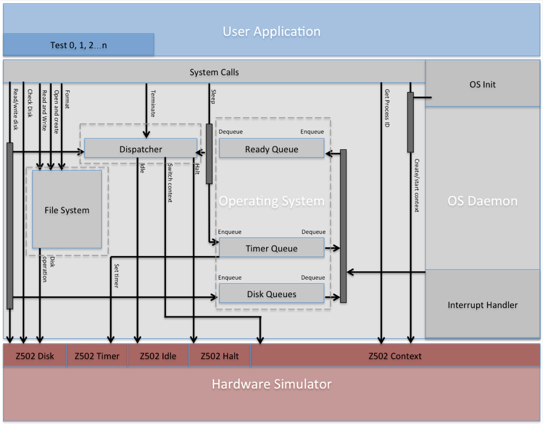
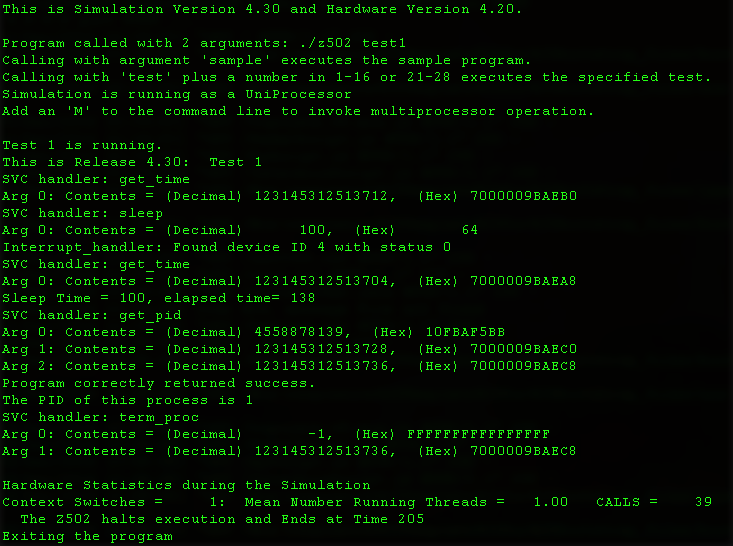
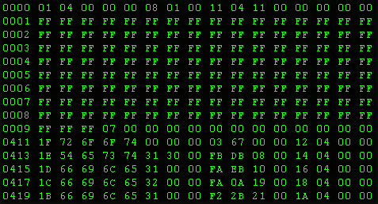

# OS502

This document is used to demonstrate some basic ideas of implement the core of OS502. The code of this project will not be put online because doing so could bring huge inconvenience to WPI CS502 class of following years. 

## Feature List:
A set of system calls

• Process related system calls;

• Disk related system calls;

• File system related system calls;

A set of interrupts handlers

• Timeout handler;

• Disk interrupt handler;

A process management and schedule system:

• PCB definition;

• Queue definition;

• One process list;

• One ready queue;

• One timer queue;

• 8 disk queues;

• Semaphores for process list and queues;

• Synchronization;

• Dispatcher;

• Auxiliary functions;

A file system:

• Data block definition;

• Block 0 definition;

• Header definition;

• Index block definition;

• Node definition;

• Disk definition;

• Data read/write procedures;

• File/Directory operation procedures;

• Auxiliary functions;

OS initialization operation

• Initialization of first process;

• Initialization of queues;

• Initialization of process list;

• Initialization of file system;

• Test kick off;

Memory Management

• Page Fault Handling;

• LRU approximation for page replacement;

• Frame table mamangement and tracking;

• Mapping of virtual memory and physical memory;

• Swap area managemnt;

## Process Schedule

## Memory Management

## Test Output

## Disk Format

